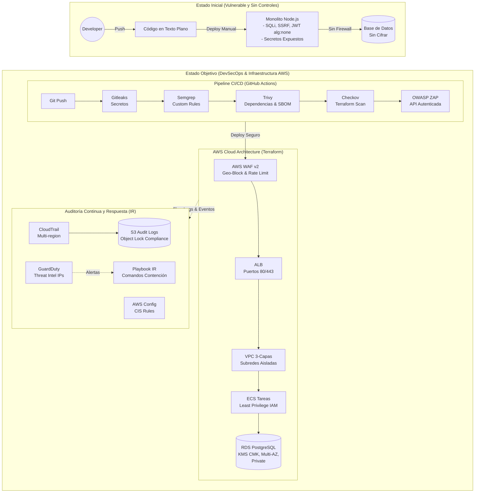

# FleetSec S.A.S - Security Engineering Assessment

Repositorio oficial para la prueba técnica de Ingeniero de Ciberseguridad. Este proyecto implementa un pipeline DevSecOps completo, infraestructura segura como código (Terraform), remediación de vulnerabilidades (VAPT) y artefactos de Respuesta a Incidentes.

---

## 1. Setup y Ejecución (Bonus: Docker Compose)

Para levantar el entorno completo de demostración de la aplicación localmente con un solo comando:

```bash
# 1. Clonar el repositorio
git clone https://github.com/williamromero-web/Analista_de_Ciberseguridad_SOC.git
cd Analista_de_Ciberseguridad_SOC/app

# 2. Levantar la aplicación localmente
docker-compose up -d --build

# 3. Verificar funcionamiento
curl http://localhost:3000/
```

---

##  2. Arquitectura de Seguridad (Estado Actual vs Objetivo)



---

## 3. Tabla de Cumplimiento

Se mapean 10 controles de seguridad implementados en la infraestructura contra estándares de la industria y regulaciones locales:

| Control de Seguridad | CIS AWS v1.4 | ISO 27001:2022 | Ley 1581 de 2012 | Estado |
|---|---|---|---|---|
| 1. Política de contraseñas estricta (14 chars) | 1.15, 1.16 | A.5.17 | Art. 19 (Seguridad) | PASS |
| 2. Cifrado de base de datos RDS con KMS | 2.3.1 | A.8.24 | Art. 19 (Seguridad) | PASS |
| 3. Bloqueo de acceso público en buckets S3 | 2.1.5 | A.8.3 | Art. 19 (Seguridad) | PASS |
| 4. Habilitar AWS CloudTrail en todas las regiones | 3.1 | A.8.15 | N/A | PASS |
| 5. Retención inalterable de logs (Object Lock) | 3.5 | A.8.16 | N/A | PASS |
| 6. Restricción de Default Security Group en VPC | 5.3 | A.8.20 | N/A | PASS |
| 7. Habilitar Amazon GuardDuty centralizado | 4.3 | A.8.16 | N/A | PASS |
| 8. Protección perimetral con WAF v2 y Rate Limit | N/A | A.8.20 | N/A | PASS |
| 9. No uso de credenciales de usuario Root | 1.4 | A.5.15 | Art. 19 | PASS |
| 10. Autenticación Multifactor (MFA) obligatoria | 1.10 | A.5.17 | Art. 19 | FAIL |

**Nota:** El control 10 se identificó como fallido durante el Análisis de Causa Raíz (RCA) del incidente de seguridad. Se encuentra priorizado (P1) en el plan de remediación.

---

## 4. Reporte de Inteligencia Artificial (Obligatorio)

**Herramientas y Tareas Específicas:**

- Utilicé LLMs (Gemini/ChatGPT) para agilizar la redacción de expresiones regulares (Regex) utilizadas en las reglas personalizadas de Semgrep.
- Asistencia en la conversión de los eventos de CloudTrail al estándar Sigma YAML para las reglas de detección.
- Resolución de errores de formato estricto multilínea (HCL) que exigía Terraform durante el terraform validate.

**Alucinación / Error de Seguridad detectado:**

Durante la configuración de exclusiones en Terraform para la herramienta Checkov (#checkov:skip), la IA sugirió colocar los comentarios de exclusión fuera de las llaves del recurso resource { ... }. Mi criterio me permitió detectar el error, ya que el pipeline fallaba repetitivamente mostrando que Checkov ignoraba las directivas. Lo corregí reubicando manualmente los comentarios dentro del bloque HCL correspondiente, permitiendo que la validación estática pasara a estado verde.

**¿Qué tareas no delegaría a la IA sin supervisión y por qué?**

No delegaría la aprobación final de políticas IAM (Principio de Menor Privilegio) ni la ejecución automatizada de comandos de respuesta a incidentes en producción (ej. apagar o aislar recursos). La IA carece del contexto de negocio profundo; un falso positivo podría llevarla a sugerir el aislamiento de una base de datos crítica, causando una interrupción masiva del servicio que sería más costosa que el incidente mismo. El criterio humano y la gestión de riesgo son irremplazables para tomar acciones destructivas o restrictivas.

---

## 5. ADRs (Decisiones de Arquitectura)

- **Imágenes Docker sin npm en Producción:** Se decidió remover el gestor de paquetes npm de la imagen final del contenedor mediante rm -rf. Razón: Reducir drásticamente la superficie de ataque y evitar vulnerabilidades de dependencias indirectas en tiempo de ejecución.
- **Supresión justificada en Checkov (WAF Logging):** Se omitió la habilitación de logs completos hacia Kinesis en el WAF (CKV2_AWS_31). Razón: Para un entorno de prueba, los CloudWatch Metrics básicos cumplen el propósito sin incurrir en costos elevados ni complejidad innecesaria.
- **WAF en modo COUNT vs BLOCK:** AWSManagedRulesCommonRuleSet se dejó en modo COUNT/Allow inicialmente. Razón: Es una mejor práctica de DevSecOps monitorear falsos positivos en tráfico legítimo antes de pasar a modo BLOCK para no romper la operatividad de la aplicación.

---

## 6. Sustentación de la Prueba Técnica

Enlace al Video de Sustentación: [VIDEO_EN_PROCESO]